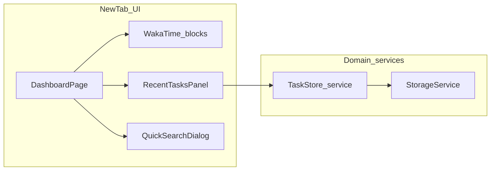

# DevTab: analytics-first new tab + companion task list (no Kanban)

## What the reference UI is telling us

The attached mockups (`DevTab v1`) establish a **clear split of intent**:

| Zone                | Role                 | What “good” looks like                                                                                                                                              |
| ------------------- | -------------------- | ------------------------------------------------------------------------------------------------------------------------------------------------------------------- |
| **Left (~2/3)**     | **Coding analytics** | WakaTime data is the hero: KPI row, activity chart, language mix, projects, then optional **Details** for deep cuts—reader scans top-to-bottom without hunting.     |
| **Right (~1/3)**    | **Task companion**   | A **single vertical stream**: capture at top, scannable rows (checkbox + title + status + context), footer links/filters—not a second “app” fighting for attention. |
| **Header**          | **Global rhythm**    | Brand left; **search** (and optional “capture” hint) centered; **tasks count**, refresh, settings right—predictable muscle memory.                                  |
| **Footer / chrome** | **Trust + time**     | Subtle bar for date range, “details” expansion, or activity tabs keeps advanced stuff **out of the primary scan path** until needed.                                |

**Kanban is deliberately absent** in these mocks: project-style work is expressed as **labels, sections, or history-style lists**, not columns you drag between. That matches “reveal intent, show content clearly”—fewer interaction modes, less spatial clutter.

## Context from the codebase and product

- **DevTab today**: MV3 new-tab override; Angular app; [`StorageService`](src/app/core/services/storage.service.ts) for credentials, dashboard cache, UI prefs, and productivity JSON.
- **Planify** remains inspiration for **fast capture** and **calm density**—not a feature clone.

## Your decisions (updated)

- **Data**: **Local-first**; versioned envelope; optional future sync hooks stay non-breaking.
- **This milestone**: **Task list only**—**remove Kanban / project board** from the shipping UX. No CDK drag-drop board, no three-column surface as a primary workflow.
- **Tasks + analytics**: **Single view**—analytics and tasks visible together on desktop; **stack** on small screens so analytics stay first.
- **Quick search**: In-tab **Mod+K** and **`/`** (non-editable focus guard); `chrome.search` + settings fallback URL template.
- **Bookmarks**: Still **out of scope** for this plan revision.

## Task model (list-first)

**Product-facing**: one mental model—“**tasks**”—implemented as a **list** with:

- **Capture** (Enter): create item quickly.
- **Row actions**: complete, edit title, optional due date, delete.
- **Status / context** shown as **badges** (not columns), e.g. `Quick`, `Doing`, `Backlog`, `Done`—aligned with current backend fields where possible (`kind`, `columnId` or future `status` enum) without requiring a board.

**Implementation note**: Today the code may still persist `kind: 'quick' | 'project'` and `columnId`. This plan **does not** add Kanban back; migration can **map** `columnId` → badge + ordering, or collapse to a simpler type in a follow-up PR (`task-model-trim` todo).

- **Defer**: Recurrence, markdown, tags, multi-board, bookmarks, global extension shortcuts (post-v1).

## Recommended layout (matches mocks)

1. **Sticky header**: logo / title · **search** (primary affordance) · tasks badge (open count) · refresh · settings.
2. **Main grid**:
   - **Column A**: “Coding analytics” — KPI strip, activity chart, languages + projects (and existing detail cards as needed).
   - **Column B**: “Recent tasks” — capture, list, empty state, footer (“View all” / filters later if needed).
3. **Periphery**: Auto-refresh chip (existing), optional **Details** `
` or footer strip for secondary analytics (commits/PRs only if/when real data exists—do not fake).

## Architecture (revised)

- **Remove** from the architecture diagram and product: **`KanbanBoard`**, CDK-connected lists as a ship feature.
- **`TaskStoreService`**: remains the single source of truth for tasks; trim public methods to list operations (no `moveProjectTaskToColumn` as a drag-driven UX requirement—**optional** keep for data migration only).

## Extension manifest and platform

- [`public/manifest.json`](public/manifest.json): `"search"` permission for [`chrome.search`](https://developer.chrome.com/docs/extensions/reference/api/search).
- **Accessibility**: Search + any new panels follow [`AGENTS.md`](AGENTS.md)—focus order, dialog semantics, keyboard completion of tasks.

## Testing strategy

- Storage parse/migrate tests after flattening or badge mapping.
- Task list component: add/remove/complete flows.
- Search adapter unchanged in spirit; regression if header wiring changes.

## Risks and mitigations

- **Users with old Kanban data**: migrate labels + order; document one-time behavior in README or settings.
- **Density**: Right column max-height + scroll; don’t let task list push analytics below the fold on desktop.

## Implementation order (suggested)

1. **Layout shell** — two-column grid + responsive stack; move floating task **drawer** into **persistent sidebar** (or keep drawer only on mobile—pick one pattern and document).
2. **Tasks list-only UI** — remove board tab / Kanban component from dashboard; single list with badges.
3. **Task model trim** — optional schema simplification + migration from `columnId`.
4. **Polish** — copy and empty states aligned with mocks (“Nothing queued…”, shortcut hints).
5. Quick search + settings unchanged except copy alignment.

## Open detail (non-blocking)

- **Global shortcut (post-v1)**: background + `commands`.
- **Bookmarks (post-v1)**: separate milestone if desired.
- **“Completed today” / suggestion chips** in mocks: add only when counts are cheap and honest (derive from `updatedAt` + local midnight, or defer).
