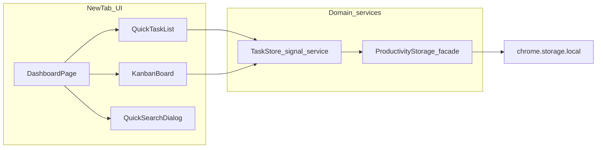

# DevTab: quick + project tasks, kanban, quick search

## Context from the codebase and product

- **What DevTab is today**: A Manifest V3 extension that overrides the new tab ([`public/manifest.json`](public/manifest.json)) with an Angular app. Persistence today is [`StorageService`](src/app/core/services/storage.service.ts) writing versioned JSON to `chrome.storage.local` (with `localStorage` fallback for non-extension dev).
- **Planify ([useplanify.com](https://useplanify.com/)) as inspiration, not a blueprint**: Borrow fast capture and board-style organization; stay extension-shaped (in-tab, minimal permissions).

## Your decisions (locked in for this plan)

- **Data**: **Local-first now**, with **explicit extension points** in domain models and a storage layer so optional sync can land later without rewriting core types.
- **Milestone shape**: **One milestone** shipping **thin** implementations: **quick tasks**, **project / kanban tasks**, **quick search**. **Bookmarks removed from this version** (no UI, no storage fields, no manifest changes for bookmarks).
- **Quick search shortcut**: **In-tab only** for v1. **Mod+K** and **`/`** open the dialog; **`/`** only when focus is **not** inside an editable field.
- **Kanban interaction**: **[Angular CDK drag-drop](https://material.angular.io/cdk/drag-drop/overview)** (`@angular/cdk` ~21) with connected `cdkDropList` per column for **project** tasks only; **non-drag** move path for a11y ([`AGENTS.md`](AGENTS.md)).
- **Layout**: **Single-page**: compact **WakaTime glance** on top, **productivity** (quick tasks + board + search affordance) below; landmarks + **“Skip to productivity”**.
- **WakaTime details default**: Charts/long breakdowns **collapsed** on load; **“Show coding details”** expands; **persist** preference in storage.
- **Backup/export**: **No** in-UI export/import in v1.

## Task kinds (this version)

Single `Task` type with **`kind: 'quick' | 'project'`**:

|                          | **Quick**                                                                                                                                               | **Project**                                                      |
| ------------------------ | ------------------------------------------------------------------------------------------------------------------------------------------------------- | ---------------------------------------------------------------- |
| **Intent**               | Fast capture, small items, “do today”                                                                                                                   | Planning / flow across columns                                   |
| **UI**                   | Dedicated **quick list** (checkbox / done, add row, optional due)                                                                                       | **Kanban** columns (Backlog / Doing / Done) with CDK + move menu |
| **Fields**               | `id`, `kind: 'quick'`, `title`, `status`, optional `dueAt`, `createdAt`, `updatedAt`, **`sortOrder`** in the quick list only                            | Same + **`columnId`**, **`sortOrder` within `columnId`**         |
| **`columnId`**           | **Omit or `null`** — not on the board                                                                                                                   | **Required** enum column                                         |
| **Status + Done column** | Same invariant as before when applicable: for project tasks, **Done** column aligns with `status: 'done'`. Quick tasks use **status** only (no column). |

- **Promote (v1)**: **“Move to board”** (or “Make project task”) on a quick task: set `kind: 'project'`, assign default column (e.g. Backlog), assign `sortOrder` at end of column. Optional **Demote** later; not required for v1.
- **Defer**: Recurrence, markdown, labels/tags, multi-board, bookmarks (future milestone if desired).

## Recommended product shape (open-source friendly)

- **Philosophy**: Versioned JSON envelope; document shape in code.
- **Kanban**: One board, fixed columns; on drop recompute `sortOrder` for affected project tasks.
- **Quick search**: `chrome.search` + `search` permission; fallback **search URL template** in settings when API unavailable.
- **UX placement**: On [`DashboardPageComponent`](src/app/features/dashboard/dashboard.page.ts), glance WakaTime above **quick tasks + kanban**; default favors productivity.

## Architecture

- **`ProductivityStorageService`**: envelope e.g. `devtab.productivity.v1` with `tasks`, optional `columns` metadata (or fixed enum in code), **`meta`** — **no `bookmarks`** in this release.
- **Sync hooks**: `TaskRepository` (local impl now); bookmark repository **not** in v1.
- **Forms**: Reactive forms per [`AGENTS.md`](AGENTS.md).

## Extension manifest and platform details

- [`public/manifest.json`](public/manifest.json): add `"search"` for [`chrome.search.query`](https://developer.chrome.com/docs/extensions/reference/api/search). No background SW / `commands` for v1.
- **Accessibility**: Search dialog focus trap, `role="dialog"`, `aria-modal="true"`.

## Testing strategy

- Unit tests: envelope parse/migrate (including tasks with `kind` and null `columnId`).
- Component tests: search adapter (`chrome.search` vs template).

## Risks and mitigations

- **Permission trust**: Short README line on `search` permission.
- **Storage**: Soft sanity cap on task count if needed.
- **Scope**: One board; no bookmarks this version.

## Implementation order (suggested)

1. Domain models + productivity envelope + `ProductivityStorageService`.
2. Quick task list + project task CRUD + promote to board.
3. Kanban board (CDK + a11y move) reading only `kind === 'project'` tasks.
4. Quick search modal + chords + `chrome.search` + settings fallback.
5. WakaTime collapsed-default + persist (can parallelize earlier if desired).

## Open detail (non-blocking)

- **Global shortcut (post-v1)**: background + `commands` if search must open from any tab.
- **Bookmarks (post-v1)**: reintroduce as separate small milestone if still wanted.
