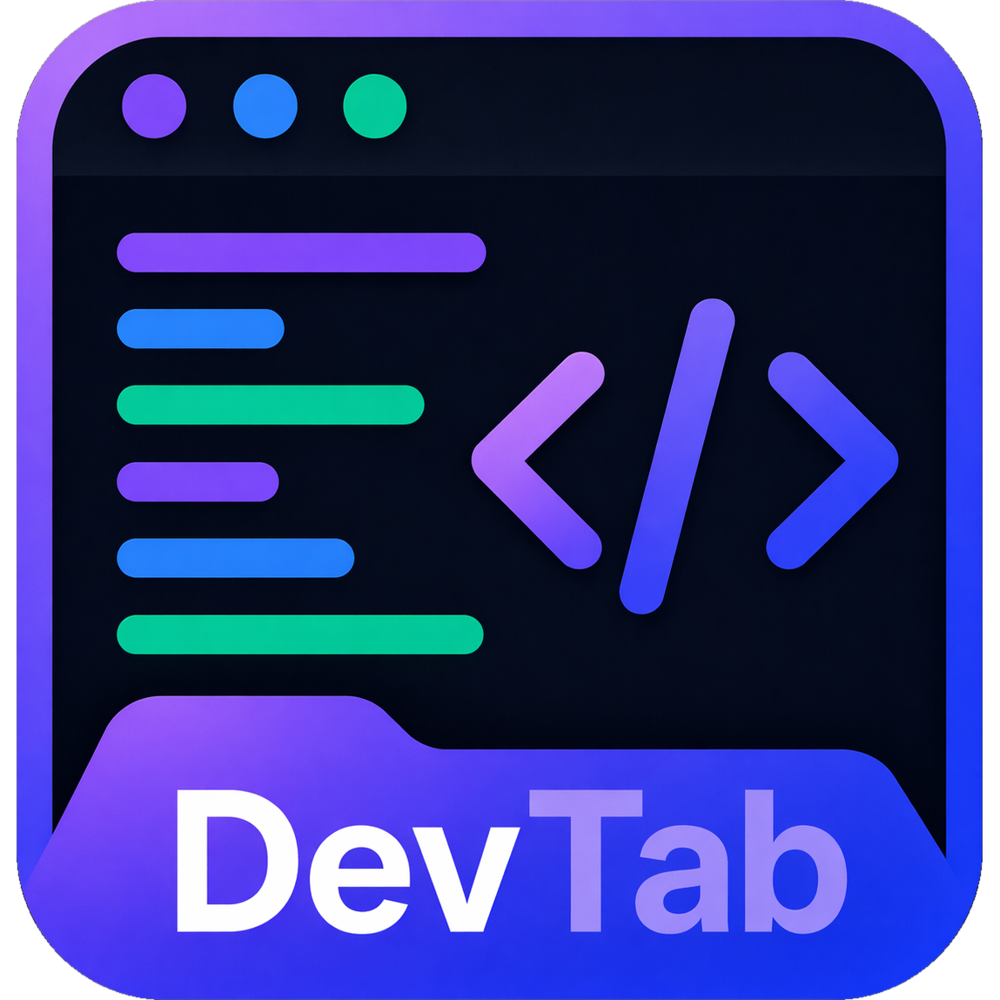

<div align="center">
  

# DevTab

A Chrome new-tab extension for developers — replaces the default new tab page
with a focused WakaTime dashboard showing the last 7 days of coding activity.

</div>

Built with Angular, TypeScript, Tailwind CSS, and Chrome Extension Manifest
V3. WakaTime is the first integration, with the code organized so future
widgets such as GitHub activity, goals, notes, quick links, and theme controls
can be added without reshaping the app.

## What It Does

- Overrides Chrome's new tab page.
- Stores a WakaTime API key or bearer token locally in `chrome.storage.local`.
- Fetches WakaTime stats from `https://api.wakatime.com/api/v1/users/current/stats/last_7_days`.
- Fetches WakaTime summaries for the 7-day activity widget.
- Shows loading, missing-auth, invalid-auth, updating, and generic error states.
- Renders modular dashboard widgets for total coding time, daily average, best day, languages, projects, editors, categories, operating systems, and daily activity.

## Project Structure

```txt
src/app/
  core/
    models/       Typed WakaTime, credential, and dashboard models
    services/     API client, storage adapter, and signal-based dashboard store
    testing/      Shared test fixtures
    utils/        Response normalization helpers
  features/
    dashboard/    New-tab dashboard page and widgets
    settings/     Credential settings panel
  shared/
    ui/           Reusable UI primitives
```

Extension files live in `public/`, including `manifest.json` and generated icon sizes. The production extension build is emitted to `dist/devtab`.

## Install

```bash
pnpm install
```

## Useful Commands

```bash
pnpm build
```

Builds the Chrome extension into `dist/devtab`.

```bash
pnpm typecheck
```

Runs Angular's compiler type check.

```bash
pnpm test -- --watch=false
```

Runs the Vitest suite once.

```bash
pnpm start
```

Runs the Angular dev server for quick UI iteration. This is useful for layout work, but browser-extension APIs such as `chrome.storage.local` only behave fully when loaded as an unpacked extension.

## Test In Chrome

1. Build the extension:

   ```bash
   pnpm build
   ```

2. Open Chrome and go to:

   ```txt
   chrome://extensions
   ```

3. Turn on **Developer mode**.

4. Click **Load unpacked**.

5. Select this folder:

   ```txt
   /Users/muneersahel/Developer/open-source/DevTab/dist/devtab
   ```

6. Open a new tab. DevTab should replace Chrome's default new tab page.

7. Click **Settings**, paste a WakaTime API key, and save.

8. Confirm the dashboard loads. To test auth handling, save an invalid token and refresh; DevTab should show the reconnect state without raw API JSON.

After code changes, run `pnpm build`, return to `chrome://extensions`, and click the reload button on the DevTab extension card before opening a fresh new tab.

## WakaTime Credentials

For v1, DevTab supports pasted credentials:

- **API key**: sent as `Authorization: Basic ${base64(apiKey)}`.
- **Bearer token**: sent as `Authorization: Bearer ${token}`.

Secrets are not hardcoded and are stored only in browser-local extension storage. A localStorage fallback exists only for local development outside the Chrome extension runtime.

## Notes

`pnpm build` uses `tools/build-extension.mjs` instead of the stock `ng build` command. In this environment, Angular's default production builder deadlocked inside esbuild, so the custom builder runs Angular AOT compilation, bundles the app, processes Tailwind CSS, and copies Manifest V3 assets into a loadable extension directory.

## Contributing

Contributions are welcome — bug fixes, new widgets, polish, docs. See
[CONTRIBUTING.md](./CONTRIBUTING.md) for the development workflow, code
conventions, and PR checklist.

The repo ships with a Husky pre-commit hook that runs Prettier on staged
files and `pnpm typecheck`, so most formatting and type issues get caught
before the commit lands.

This project uses [pnpm](https://pnpm.io/) as its package manager.

## License

DevTab is released under the [MIT License](./LICENSE).
